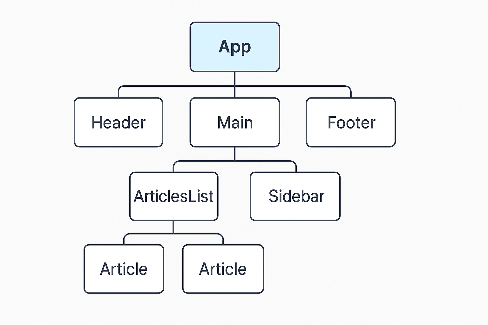
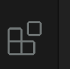
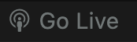

# **Introduction à React**

Pour revenir à la page d'accueil

[Plan du cours](https://antoine07.github.io/react_web2/#2)

---

## Objectifs pédagogiques

*À la fin de cette séance vous devriez être capable :*

* comprendre le rôle de React et du Virtual DOM ;
* créer une interface simple avec `React.createElement()` et `ReactDOM` sans JSX ;
* écrire leurs premiers composants React fonctionnels ;
* comprendre ce que JSX apporte et comment Babel le transforme. Et utilisez une meilleure expressivité pour créer vos composants.

---

## 1. Introduction — Pourquoi React ?

Avant React, les développeurs manipulaient directement le **DOM** avec du JavaScript classique :

```js
const el = document.createElement("h1");
el.textContent = "Hello";
document.body.appendChild(el);
```

---

### Cette approche devient vite complexe lorsque :

* l'interface doit se mettre à jour fréquemment ;
* plusieurs éléments changent en même temps ;
* le code doit rester maintenable.

---

### React apporte la solution optimale :

* une **approche déclarative** : on décrit l'état final de l'interface sous forme de composant `<App/>`.
* un **Virtual DOM** : une représentation virtuelle du DOM réel pour rendre les mises à jour efficaces;
* une structure **modulaire** : les composants.

---

### Structure hiérarchique d'une interface React



> Chaque nœud représente un composant déclaratif.
---

## **Décrire l'UI comme un arbre de composants**

Chaque interface React est composée **d'un arbre de composants** :

* `App` est la **racine**.
* Chaque composant peut contenir d'autres **composants enfants**.
* L'arborescence représente **la hiérarchie logique** de l'interface (et non le DOM réel).

> React parcourt cet arbre pour décider **quelles parties mettre à jour** lors d'un rendu.


---

## 2. Créer une première page React

---

###  Structure de projet 

Vous allez copier/coller le fichier qui suit dans un fichier HTML classique, mais avant organisez-vous comme suit :

- Créez un dossier `COURS_REACT` sur votre bureau.
- Ouvrez ce dossier avec `vscode`.
- Créez un sous dossier `introduction` 
- Créez un autre sous dossier `Examples`.

---

### Remarque

Dans la prochaine slide vous copier/coller le code du fichier d'exemple et vous faites un `Go Live` depuis votre `vscode` opour afficher le résultat.

---

```html
<!DOCTYPE html>
<html lang="fr">
  <head>
    <meta charset="UTF-8" />
    <meta name="viewport" content="width=device-width, initial-scale=1.0" />
    <title>React sans JSX</title>
  </head>
  <body>
    <div id="root"></div>

    <!-- React et ReactDOM via CDN -->
    <script src="https://unpkg.com/react@18/umd/react.development.js" crossorigin></script>
    <script src="https://unpkg.com/react-dom@18/umd/react-dom.development.js" crossorigin></script>

    <script>
      const root = ReactDOM.createRoot(document.getElementById("root"));

      // Création d'éléments React sans JSX
      const title = React.createElement("h1", null, "Hello React!");
      const paragraph = React.createElement("p", null, "This is React without JSX.");

      const app = React.createElement("div", { className: "container" }, [title, paragraph]);

      root.render(app);
    </script>
  </body>
</html>
```
---

### Comment voir le résultat 

Installez cette extension



Plugin officiel


---

### Go Live

Ouvrez votre fichier `index.html` dans `vscode` et cliquez sur le bouton en bas à gauche de l'éditeur. Vous verrez alors le rendu de votre premier code React dans votre navigateur.



---

###  Explication

La fonction :

```js
React.createElement(type, props, ...children)
```

crée un **élément React virtuel** (un objet JavaScript), que ReactDOM traduit ensuite dans le DOM réel.

---

Exemple :

```js
React.createElement("h1", { className: "title" }, "Hello!");
```

est équivalent à dans le DOM virtuel à :

```html
<h1 class="title">Hello!</h1>
```

mais en mémoire seulement, jusqu'à ce que `root.render()` soit exécuté.

---

### On va détailler le fonctionnement du DOM virtuel

---

###  **React.createElement() et le Virtual DOM**

**But :** décrire une interface **sans manipuler directement le DOM.**

```js
React.createElement("h1", { className: "title" }, "Hello!");
```

Ce code **ne crée pas** encore une balise dans le navigateur.
Il crée **un objet JavaScript** qui *décrit* cette balise :

```js
{
  type: "h1",
  props: {
    className: "title",
    children: "Hello!"
  }
}
```

---

**C'est le "Virtual DOM"** : une copie en mémoire du DOM réel.

---

### Résumé sur les paramètres de React.createElement 

```txt
React.createElement(type, props, children);
```

---

### **Du Virtual DOM au DOM réel**

Le rendu n'a lieu **qu'au moment de l'appel à** `root.render()`

---

### Rappelons le code en jeu

```js
const root = ReactDOM.createRoot(document.getElementById("root"));
root.render(
  React.createElement("h1", { className: "title" }, "Hello!")
);
```

---

1. React crée un **Virtual DOM** (représentation en mémoire du DOM réel).
2. Lors du rendu, il **compare le Virtual DOM au DOM réel** (*diffing algorithm*).
3. Il **met à jour uniquement** les parties du DOM qui ont changé.
4. Le navigateur affiche finalement :

```html
<h1 class="title">Hello!</h1>
```


 **Avantage :** rendu optimisé, plus rapide, code prévisible et plus facile à maintenir.


---

## 3. Créer des composants sans JSX

Un **composant React** est une fonction qui retourne un élément React.

---

```html
<script>
  function Hello() {
    return React.createElement("h2", null, "Hello World Component");
  }

  function App() {
    return React.createElement("div", null, [
      React.createElement(Hello, null),
      React.createElement("p", null, "Rendered without JSX.")
    ]);
  }

  const root = ReactDOM.createRoot(document.getElementById("root"));
  root.render(React.createElement(App));
</script>
```

---

##  **Exercice 1 — React et ReactDOM purs**

Affichez HELLO WORLD dans un fichier HTML.
Créez un paragraphe dans un div en écrivant le texte suivant :

*Le Virtual DOM est une copie du DOM en mémoire que React utilise pour préparer les changements sans toucher directement à la page.
Il compare les différences et met à jour uniquement ce qui a changé, pour un rendu rapide et efficace.*

---

##  **Exercice 2 — React et ReactDOM purs**

Créez un composant `ProfileCard` affichant :
une image (prop `image`) ;
un nom (prop `name`) ;
un rôle (prop `role`).

### Remarques

`React.createElement(type, props, children)` crée un **élément virtuel** (balise HTML ou composant React); `props` correspond aux **attributs** ou **données** passées à l'élément. Les composants peuvent être **imbriqués** en utilisant d'autres fonctions React dans `type`, ce qui permet de construire toute l'interface à partir de fonctions.

---

## 4. Introduction de JSX et de Babel

### Pourquoi JSX ?

JSX est une **extension de syntaxe JavaScript**.
Elle permet d'écrire des composants de manière plus lisible et naturelle.

```jsx
const element = <h1>Hello JSX!</h1>;
```

est transformé par Babel en :

```js
const element = React.createElement("h1", null, "Hello JSX!");
```

---

JSX est une **syntaxe déclarative et expressive** qui simplifie l'écriture du code React.

---

### ⚠️ **Ce n'est pas du JavaScript natif**

 Ce n'est **pas du JavaScript natif**, mais une **extension de syntaxe** qui doit être **transformée (transpilée)** en JavaScript pur par un outil comme **Babel** avant d'être exécutée par le navigateur.

---

### Activation de Babel dans notre page

--- 

Modifiez du fichier `index.html` pour prendre en compte Babel et donc interpréter le code JSX.

---

```html
<script src="https://unpkg.com/@babel/standalone/babel.min.js"></script>

<script type="text/babel">
  function Hello() {
    return <h2>Hello World Component</h2>;
  }

  function App() {
    return (
      <div>
        <Hello />
        <p>Rendered with JSX and Babel.</p>
      </div>
    );
  }

  const root = ReactDOM.createRoot(document.getElementById("root"));
  root.render(<App />);
</script>
```

---

### Remarques

* JSX **n'est pas** du HTML, mais du JavaScript enrichi.
* Babel le compile automatiquement en appels à `React.createElement`.

---

## **Exercice 3**

1. Créer un composant `ProductCard` (avec image, name, price) avec JSX et Babel.
2. Comparer la lisibilité des deux approches avec le précédent exercice sans JSX.

---

## 5. Expressions JavaScript dans JSX

Dans JSX, les expressions JavaScript se placent entre `{}` :

```jsx
function App() {
  const hour = new Date().getHours();
  const message = hour < 12 ? "Good morning!" : "Good evening!";

  return (
    <div>
      <h1>{message}</h1>
      <p>It is currently {hour} o'clock.</p>
    </div>
  );
}
```

---

## 6. Règles essentielles du JSX

###  **Un seul élément parent** doit envelopper le retour d'un composant :

   ```jsx
   return (
     <div>
       <h1>Hello</h1>
       <p>Welcome</p>
     </div>
   );
   ```

   ou utiliser un **fragment** (`<React.Fragment></React.Fragment>`) si nécessaire pour créer un parent virtuel dans le cas où l'on a pas besoin d'élément parent.

   ```jsx
   return (
     <React.Fragment>
       <h1>Hello</h1>
       <p>Welcome</p>
    <React.Fragment/>
   );
   ```

---

### Les **attributs** utilisent la notation camelCase :

   * `class` devient `className`
   * `for` devient `htmlFor`
   * les événements : `onClick`, `onChange`, etc.

---

### JSX ne supporte pas les instructions complètes (ex. `if`, `for`), uniquement des **expressions**.
   Pour des conditions ou des boucles, on utilise le JavaScript à l'extérieur ou à l'intérieur avec `{}`.

---

## 7. Conditions et listes dans JSX

### Conditionnel

Les conditions se font avec l'opérateur ternaire ou logique courte :

```jsx
{isLoggedIn ? <Dashboard /> : <Login />}
{error && <p className="error">{error}</p>}
```

---

### Listes

Les listes d'éléments s'affichent avec `map()`, et chaque élément doit avoir une clé unique (`key`) :

```jsx
function TodoList({ todos }) {
  return (
    <ul>
      {todos.map(todo => (
        <li key={todo.id}>{todo.text}</li>
      ))}
    </ul>
  );
}
```

---

## 8. Sécurité — Introduction injection XSS et JSX 

---

### Définition de la faille XSS

Une faille **XSS (Cross-Site Scripting)** permet à un attaquant d'injecter du code JavaScript malveillant dans une page, pouvant voler des données ou détourner une session utilisateur.
C'est l'une des vulnérabilités les plus critiques du web, d'où l'importance de toujours **assainir et contrôler les données affichées**.

---

###  Protection automatique

React **protège par défaut** contre les injections de code (XSS).
Toute donnée insérée avec `{}` est **échappée automatiquement** :
les balises ou scripts sont affichés comme du texte, pas interprétés.

```jsx
const userInput = '';
<div>{userInput}</div>; // Affiche le texte, sans exécuter le code
```

---

### Cas dangereux : `dangerouslySetInnerHTML`

Cette propriété insère du HTML brut dans le DOM **sans échappement** :

```jsx
<div dangerouslySetInnerHTML={{ __html: htmlFromServer }} />
```

Elle doit être utilisée **uniquement** avec du contenu sûr ou nettoyé :

```js
import DOMPurify from "dompurify";
const safe = DOMPurify.sanitize(unsafeHtml);
<div dangerouslySetInnerHTML={{ __html: safe }} />;
```

---

### Règle simple à retenir

> Dans React, `{}` est sûr,
> `dangerouslySetInnerHTML` ne l'est pas.

---

## 9.Résumé JSX 

| Sujet               | Essentiel                                          |
| ------------------- | -------------------------------------------------- |
| Expressions `{}`    | Permettent d'évaluer du JS dans le JSX             |
| Structure           | Un seul élément parent ou un fragment              |
| Attributs           | camelCase (ex. `className`, `onClick`)             |
| Conditions / Listes | Ternaires et `map()`                               |
| Sécurité            | React échappe automatiquement les valeurs insérées |
| Danger              | `dangerouslySetInnerHTML` contourne la protection  |

---

## **4. Exercice  — Affichage la liste d'étudiants suivantes**

Affichez une liste dans le DOM, inspirez-vous de l'exemple ci-après pour l'utilisation d'un map.

```js
const students = [ "Alan", "Alice", "Sophie"];
```

- Syntaxe `map`

```js
const array = ["A", "B", "C", "D"];

array.map((item, index) => {
  console.log("Item:", item, "Index:", index);
});
```

---

## **5. Exercice — Calcul de moyenne des étudiants suivants**

Dans un nouveau fichier calculez la moyenne dans une page Web en React avec JSX.

```jsx

const students = [
{ name: "Alice", grade: 15 },
{ name: "Bob", grade: 12 },
{ name: "Charlie", grade: 18 },
{ name: "Diana", grade: 14 },
];

```

---

## Merci d'avoir écouter cette première partie

Pour revenir à la page d'accueil

[Plan du cours](https://antoine07.github.io/react_web2/#2)