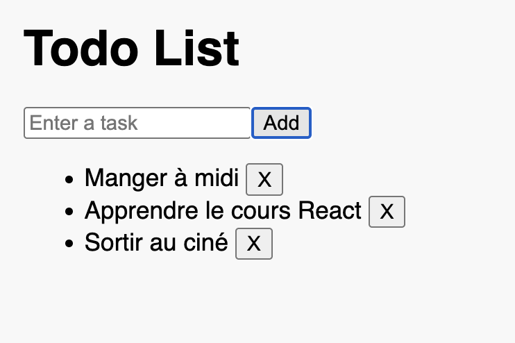

# Plan du cours sur les `state`

1. On introduit d'abord `state`,
1. ensuite les hooks,
1. puis `useState`,
1. exemples et exercices,
1. communication,
1. immutabilité en dernier (logiquement liée aux bonnes pratiques).

---

# **State dans React**

Pour revenir à la page d'accueil

[Plan du cours](https://antoine07.github.io/react_web2/#2)

---

## 1. Introduction

### Définition

Le **state** représente les **données internes** d'un composant React.
Contrairement aux **props** (données *reçues* du parent), le state correspond à des **valeurs que le composant gère lui-même**, susceptibles d'évoluer dans le temps.

> Le state rend un composant **interactif** : il permet de changer ce qui s'affiche à l'écran **sans recharger la page**.

---

## 2. Différence entre props et state

| Critère            | Props                        | State                             |
| ------------------ | ---------------------------- | --------------------------------- |
| Origine            | Transmises par le parent     | Géré localement dans le composant |
| Lecture / écriture | Lecture seule                | Modifiable via `setState`         |
| Flux de données    | Descendant (parent → enfant) | Interne au composant              |
| Objectif           | Personnaliser un composant   | Le rendre interactif / dynamique  |

---

## 3. Notions de base sur les Hooks

Les **Hooks** sont des **fonctions spéciales de React** qui permettent d'ajouter des fonctionnalités avancées aux **composants fonctionnels** (gestion d'état, effets, contexte…).
Ils ont été introduits pour remplacer les anciens **composants de classe** et rendre le code plus simple et réutilisable.

---

### Un hook commence toujours par `use` :

```jsx
useState()   // gère un état local
useEffect()  // exécute un effet (ex: appel API) ou le verra plus loin
```

---

## 4. Le hook `useState()`

React fournit le **hook** `useState()` pour créer et gérer une variable d'état.

```jsx
const [state, setState] = React.useState(valeurInitiale);
```

* `state` : la valeur actuelle
* `setState` : une fonction pour mettre à jour la valeur
* chaque mise à jour du state provoque un **nouveau rendu** du composant.

---

## 5. Exemple simple : compteur

```jsx
function Counter() {
  const [count, setCount] = React.useState(0);

  return (
    <div>
      <h2>Count: {count}</h2>
      <button onClick={() => setCount(count + 1)}>Increment</button>
      <button onClick={() => setCount(count - 1)}>Decrement</button>
      <button onClick={() => setCount(0)}>Reset</button>
    </div>
  );
}

const root = ReactDOM.createRoot(document.getElementById("root"));
root.render(<Counter />);
```

---

### Mécanisme :

1. `count` vaut `0` au départ.
2. Lorsqu'on clique sur un bouton, `setCount()` change la valeur.
3. React **re-render** le composant avec la nouvelle valeur (mise à jour partielle du DOM).

---

## 6. Règles d'utilisation des Hooks

1. Toujours appeler `useState()` **au niveau supérieur** du composant (jamais dans une boucle ou une condition).
2. Un hook ne doit être appelé **que dans un composant fonctionnel** ou un **hook personnalisé**.
3. La fonction de mise à jour (`setCount`) **remplace la valeur**, elle ne fusionne pas comme dans les classes.

---

## 7. Exercice — compteur

Créer un composant `Counter` avec trois boutons :

* Incrémenter
* Décrémenter
* Réinitialiser

**Bonus :** empêcher le compteur de descendre sous 0.

---

## 8. Exemple — champ de saisie contrôlé

Un **composant contrôlé** garde la valeur d'un input dans le state.

```jsx
function NameInput() {
  const [name, setName] = React.useState("");

  return (
    <div>
      <input
        type="text"
        placeholder="Enter your name"
        value={name}
        onChange={(e) => setName(e.target.value)}
      />
      <p>Hello, {name || "anonymous"}!</p>
    </div>
  );
}
```

---

### Dans le champ contrôlé :

* La valeur de l'input est **liée** au `state`.
* Chaque frappe met à jour `name`.
* React réaffiche automatiquement le texte.

---

## 9. Exercice — Formulaire simple

Créer un composant `LoginForm` :

* deux champs (`email`, `password`) contrôlés par le state,
* un bouton "Submit" qui affiche les valeurs saisies dans la console,
* vider les champs après soumission.

Utiliser :

```jsx
setEmail("");
setPassword("");
```

---

## 10. Exercice — ToDo List

Créer une petite **ToDo List** :



---

## 11. Gestion d'état et réactivité

React ne met pas le state à jour **immédiatement**.
Les mises à jour sont **planifiées** et peuvent être regroupées avant le re-render.

```jsx
setCount(count + 1);
setCount(count + 1);
// Les deux utilisent l'ancienne valeur !
```

Solution : utiliser la version fonctionnelle :

```jsx
setCount(prev => prev + 1);
setCount(prev => prev + 1);
// Résultat correct : +2
```

---

## 12. Communication parent / enfant avec state

Le parent peut gérer un state et le **transmettre à un enfant via des props** :

```jsx
function Child({ value, onIncrement }) {
  return <button onClick={onIncrement}>Count: {value}</button>;
}

function Parent() {
  const [count, setCount] = React.useState(0);
  return <Child value={count} onIncrement={() => setCount(count + 1)} />;
}
```

Les données **descendent** (via `props`), les actions **remontent** (via callbacks).
C'est le **flux unidirectionnel** de React : *props → state → events*.

---

## 13. Bonnes pratiques sur le state

**À faire :**

* Initialiser le state avec une valeur par défaut.
* Toujours utiliser `setState`, jamais modifier directement.
* Grouper les données liées dans un même objet si logique commune :

  ```jsx
  const [user, setUser] = React.useState({ name: "", email: "" });
  ```

**À éviter :**

* Modifier directement le state :

  ```jsx
  count++; // ne déclenche pas de re-render
  ```
* Multiplier les states isolés pour des données liées.
* Oublier les clés uniques dans les listes (`key={index}`).

---

## 14. À retenir

| Concept               | Description                                                        |
| --------------------- | ------------------------------------------------------------------ |
| **State**             | Données internes du composant, évolutives                          |
| **useState()**        | Hook pour déclarer une variable d'état                             |
| **Re-render**         | Chaque changement de state relance le rendu                        |
| **Flux de données**   | Parent → props → enfant                                            |
| **Immutable updates** | Toujours créer une **nouvelle** valeur, jamais modifier l'ancienne |

---

## 15. Les mises à jour immuables

### Principe

En React, on **ne modifie jamais directement** une donnée (objet, tableau) contenue dans un `state` ou une `prop`.
On crée **une nouvelle version** avec les modifications souhaitées.

> "Immuable" signifie qu'on **ne change pas la valeur d'origine**, on en **crée une nouvelle**.

---

### Exemple non immuable (à ne pas faire)

```jsx
const [user, setUser] = React.useState({ name: "Alice", age: 20 });
user.age = 21;
setUser(user); // mauvais
```

Ce code **ne déclenche pas de re-render**, car React croit que l'objet est identique (même référence).

---

### Exemple immuable (correct)

```jsx
const [user, setUser] = React.useState({ name: "Alice", age: 20 });
setUser({ ...user, age: 21 }); // crée un nouvel objet
```

`{ ...user }` crée une **copie** de l'objet existant,
et React détecte une **nouvelle référence** → mise à jour du rendu.

---

### Même principe pour les tableaux

```jsx
const [numbers, setNumbers] = React.useState([1, 2, 3]);

// Mauvais
numbers.push(4);
setNumbers(numbers);

// Bon
setNumbers([...numbers, 4]);
```

---

### À retenir

Une "immutable update" = créer une **nouvelle copie modifiée**
au lieu de modifier directement la valeur d'origine.
Cela permet à React de détecter le changement et de **re-render correctement** le composant.

---

## Merci d'avoir écouter cette partie sur les states

Pour revenir à la page d'accueil

[Plan du cours](https://antoine07.github.io/react_web2/#2)