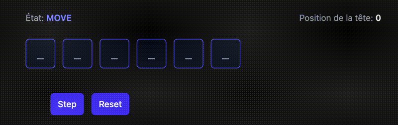

## Sujet : Implémenter une mini « machine à additionner » avec Zustand

### Présentation



## Pour vous aidez dans le dossier des TPs vous trouverez des modèles UI/UX

[model machine ruban](../TPs/models_machine_R/)

On veut simuler une machine très simple inspirée de la machine de Turing.
Elle va **transformer des symboles en unaire** :

```txt
_ = 1
```


Nous allons représenter la bande (mémoire) comme un tableau :

```
["_", "_", "_", "_", "_", "_", "_"]
```

Le rôle de la machine est de **lire un premier`_` et de remplacer ce symbole par `1`, c'est tout pour l'instant.


---

### Règles de transition de la machine

La machine possède **un état** (ici toujours `A` jusqu'à l'arrêt),
une **tête de lecture** (un index dans le tableau),
et applique ces règles :

| État | Symbole lu | Écrire | Déplacer             | Nouvel état |
| ---- | ---------- | ------ | -------------------- | ----------- |
| A    | _          | 1      | → (droite)           | A           |

Lorsque vous arrivez à la fin du tableau vous mettez votre machine à l'arrêt, un bouton reset remettra la machine dans son état initial.

---

### Contraintes de l'exercice

1. Installez les dépendances `zustand` et `tailwind css`

1. Créer un **store Zustand** contenant :

   * `tape` : la bande (un tableau de chaînes de caractères)
   * `head` : position actuelle de la tête (index)
   * `mode` : état actuel (`"A"` au départ)
   * `step()` : exécuter **un pas** selon les règles
   * `reset()` : remettre la machine à l'état initial

1. Créer une **interface React simple** permettant :

   * d'afficher la bande avec la position de la tête
   * de voir l'état actuel
   * un bouton `Step`
   * un bouton `Reset`

---

### Ajoutez la structure et les pages suivantes dans le projet 

```txt
├── components
│   ├── Cell.jsx
│   ├── MachineTuring.jsx
├── index.css
├── main.jsx
└── stores
    └── useMachineStore.js
```


### Travail attendu

* Ajouter le composant React affichant la bande et les boutons sur la bonne page.
* Tester l'exécution étape par étape (avec un clique)
* Vérifier le passage à l'état `HALT` et l'écriture unaire.
